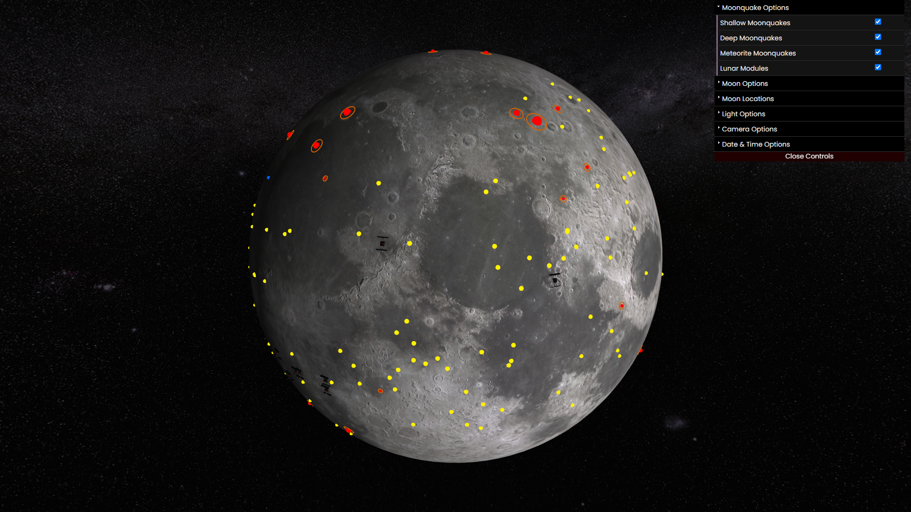
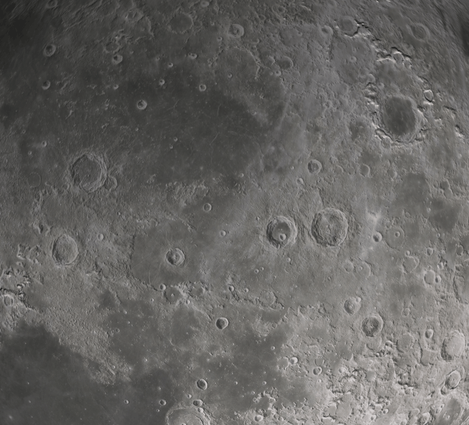
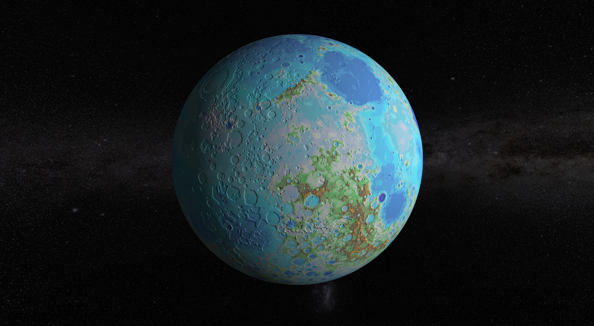
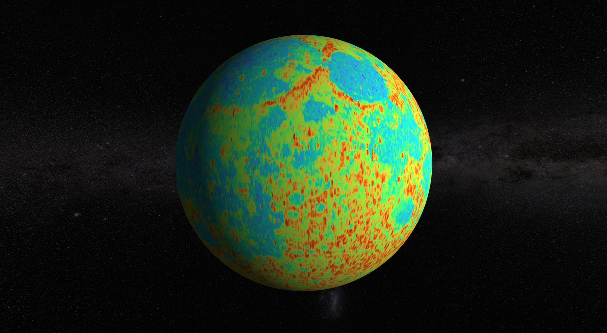
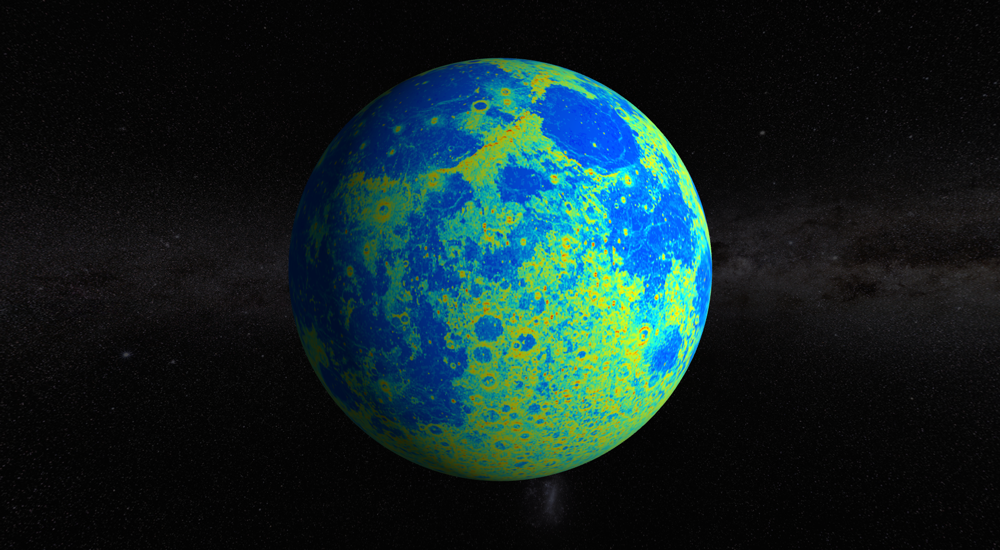
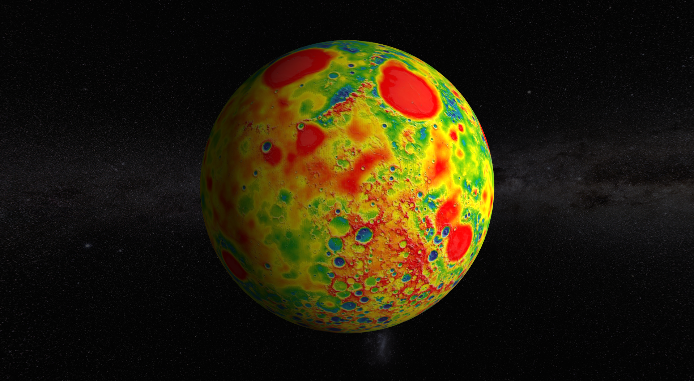
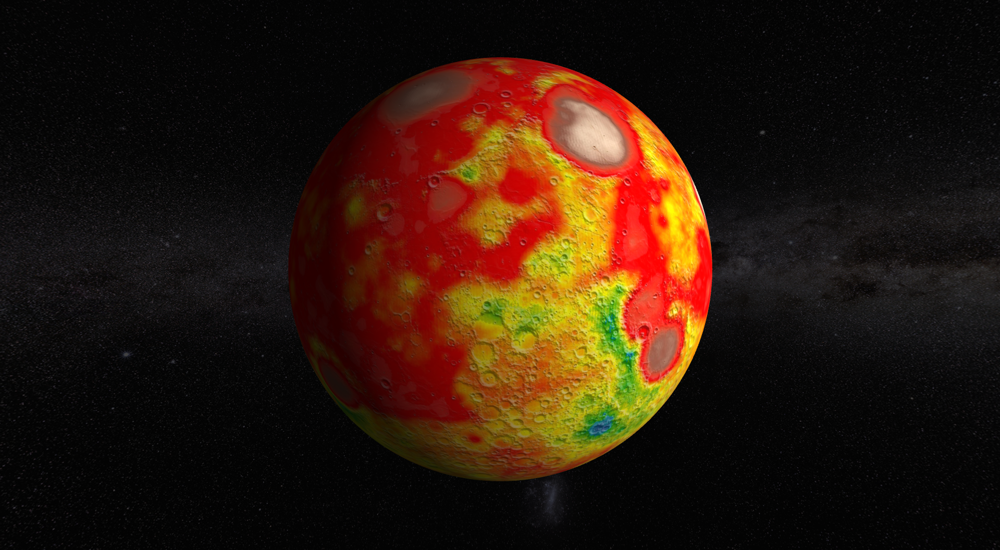
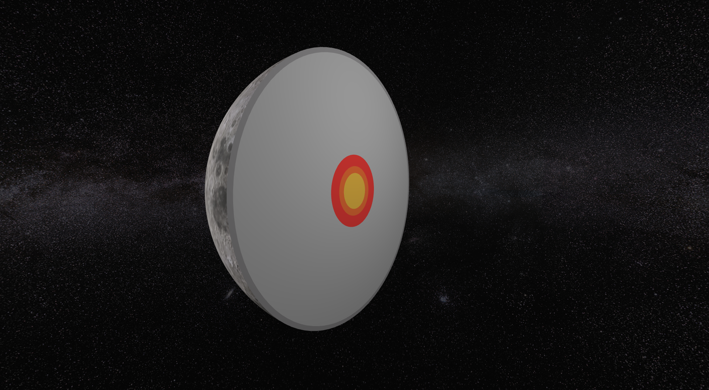
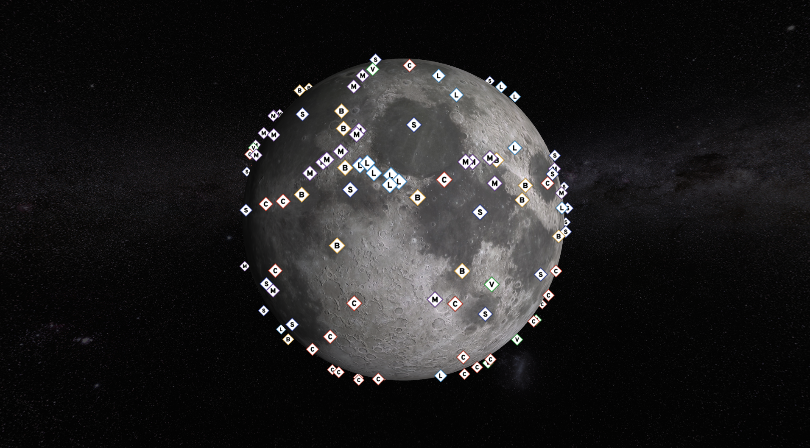
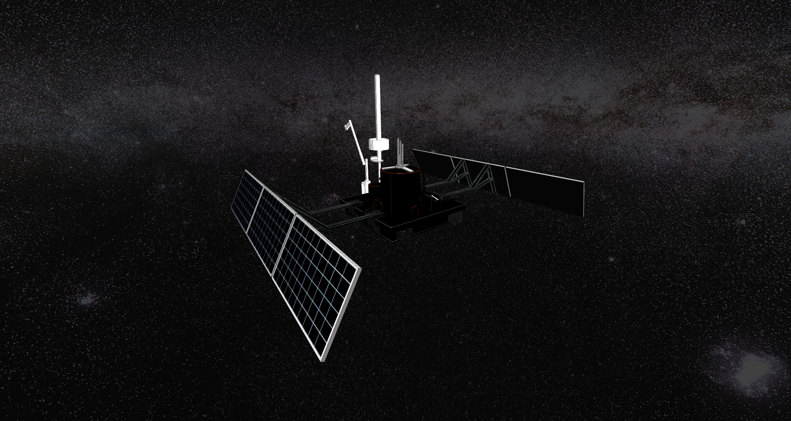

---

# Our Website

Head over to https://aberration.dev to view our website in action.

# Summary

With [Aberration.dev](https://aberration.dev), a cutting-edge website made for visualizing seismic occurrences picked up by NASA's Apollo mission instruments, explore the Moon like never before. Take part in a stunning 3D lunar experience that allows players to customize the camera, rotation, and lighting settings for an unmatched exploration. A dynamic 3D model that realistically depicts seismic occurrences with concentric torus shapes adds a visually arresting element to the data by bringing them to life on the lunar surface. At given dates, the user can select to view a 3D waveform of the moonquake occurring live on the surface of the moon. Examine a multitude of details, including event locations, dates, and timings, to gain important insights about lunar geophysical activity. The platform offers a variety of color maps, including topography, surface roughness, and gravity, with the ability to dissect the moon and analyze its structure, enabling users to fully comprehend the Moon's special characteristics. Moreover, users can view all the special locations on the moon's surface, like lunar craters, seas, and more. Aberration.dev converts enormous scientific datasets into a usable and interesting experience, enabling users to easily explore and interpret difficult data. It provides access to the wonders of lunar research for both scientists and space enthusiasts, making the impossible real.

<!-- [Aberration.dev](https://aberration.dev) is a website that was developed for the purpose of visualizing the moonquakes caused by several different events. The website comes with various different features to increase user experiences such as a fully interactive 3D model of the moon with settings to alter the lighting, rotation, and camera options. However, the main feature is that it also allows the user to see the different moonquakes on the surface of the moon as well as the different modules that sent the data. With the use of [aberration.dev](https://aberration.dev), a lot of time could be saved rather than analyzing scientific data shown on disorderly spreadsheets. -->

# Project Demo Video

Head over to [this video](https://youtu.be/AyvkHZV3Et8) to see a demo of our project in action.

# Project Details

## Background

From 1968 to 1972, crewed Apollo missions were carried out. To keep track of the geophysical activities taking place on the moon, the astronauts left behind many seismometers on the lunar surface. These seismometers recorded data on exabyte cassettes and transmitted it back to Earth. Scientists have since conducted a thorough analysis of the data to learn more about the interior makeup of the moon. Despite the fact that the data has been around for a while, we were unable to locate a tool that could plot and visually represent the seismic wave's propagation in a user-friendly manner.

## Features

-   Toggle between the different types of moonquakes like the shallow quakes, deep quakes, and meteorite collisions
-   Time-series data and view a moonquake 3D waveform
-   View lunar topography map, surface roughness maps, and gravity maps
-   Dissect moon and view its layers
-   View moon locations (lunar craters, seas, mountains, ..etc.)
-   View the moonquake's seismograph generated from ObsPy
-   Rotate moon and edit lighting
-   Experience the moonquake in its own 3D environment
-   View the 3D lunar module that NASA used in its own 3D environment

## Tools Used

The project was developed using:

-   The web app was developed in ThreeJS using ReactJS
-   ObsPy for processing seismic data
-   All 2D assets were done in Adobe Photoshop and Adobe Illustrator
-   All 3D assets and animations were created in Blender, ThreeJS, Adobe After Effects, and Adobe Premiere Pro

## Visualization

-   **Moonquake Waveform:**
    
-   **Moon Topography Map:**
    

-   **Moon Surface Roughness Maps:**

    1. Hurst Exponent:
       
    2. Median Absolute Slope:
       

-   **Moon Gravity Map**

    1. Free-Air:
       
    2. Bouguer:
       

-   **Moon Layers:**
    

-   **Lunar Locations:**
    

-   **Lunar Module:**
    

## Resources and References

[1] [NASA CGI Moon Kit](https://svs.gsfc.nasa.gov/cgi-bin/details.cgi?aid=4720)

[2] [PDS Geoscience Node](https://pds-geosciences.wustl.edu/lunar/urn-nasa-pds-apollo_seismic_event_catalog/data/)

[3] [NASA 3D Resources](https://nasa3d.arc.nasa.gov/models)

[4] [IRIS DMC](http://ds.iris.edu/ds/nodes/dmc/forms/assembled-data/?dataset_report_number=90-003)

[5] [Moon LRO LOLA](https://astrogeology.usgs.gov/search/map/Moon/LMMP/LOLA-derived/Lunar_LRO_LOLA_ClrShade_Global_128ppd_v04)

[6] [NASA’s Planetary Geology, Geophysics and Geochemistry Laboratory](https://pgda.gsfc.nasa.gov/)

[7] [Lunar Reconnaissance Orbiter Camera](https://wms.lroc.asu.edu/lroc/rdr_product_select)

[8] [Global surface slopes and roughness of the Moon from the Lunar Orbiter Laser Altimeter](https://agupubs.onlinelibrary.wiley.com/doi/full/10.1029/2010JE003716)

[9] [The global surface temperatures of the Moon as measured by the Diviner Lunar Radiometer Experiment](https://www.sciencedirect.com/science/article/pii/S0019103516304869)

[10] [Lunar Reconnaissance Orbiter: Detailed Topography of the Moon](https://lunar.gsfc.nasa.gov/images/lithos/LRO_litho8-lunar_topography.pdf)

[11] [LRO Lunar Orbiter Laser Altimeter (LOLA)](<https://ode.rsl.wustl.edu/moon/pagehelp/Content/Missions_Instruments/Lunar%20Reconnaissance%20Orbiter%20(LRO)/LOLA/Intro.htm>)

[12] [LRO LOLA Gridded Data Record Roughness Map (GDRDRM)](https://ode.rsl.wustl.edu/moon/pagehelp/Content/Missions_Instruments/LRO/LOLA/GDR/GDRDRM.htm)

[13] [PDS Geosciences Node LRO: LOLA](https://pds-geosciences.wustl.edu/missions/lro/lola.htm)

[14] [ThreeJS](https://threejs.org/)

[15] [Lunar Reconnaissance Orbiter Camera Product Search](https://wms.lroc.asu.edu/lroc/rdr_product_select?filter%5Btext%5D=&filter%5Blat%5D=&filter%5Blon%5D=&filter%5Brad%5D=&filter%5Bwest%5D=&filter%5Beast%5D=&filter%5Bsouth%5D=&filter%5Bnorth%5D=&filter%5Btopographic%5D=true&show_thumbs=1&per_page=100&commit=Search)

[16] [Planetary Geodesy Data Archive](https://pgda.gsfc.nasa.gov/products/view/66)

[17] [Slope and Azimuth from SLDEM2015](https://pgda.gsfc.nasa.gov/products/67)

[18] [Lunar slopes and Hurst exponent](https://pgda.gsfc.nasa.gov/products/70)

[19] [Lunar Gravity Field: GRGM1200A](https://pgda.gsfc.nasa.gov/products/50)

[20] [XA (1969-1977): Apollo Passive Seismic Experiments](https://www.fdsn.org/networks/detail/XA_1969/)

# Usage

**If you are interested in running the source files:**

1. Download the repository as a zip file and extract it in your preferred directory.
2. Open a terminal instance in the folder `./aberration` and run `npm install`.
3. Run `npm run dev` to launch a local instance.
4. You should now be prompted an address locally to open to view the website (something along the lines of `127.0.0.1:5173`)
5. Now, you are free to enjoy the website and play around with all the different options!

This is not the end of the project. We hope to continue pushing frequent updates to add more models and features to the website. Feel free to use this code as open-source. If you have any questions or ideas for future work, please email me personally at rlphrazz `at` gmail `dot` com.
